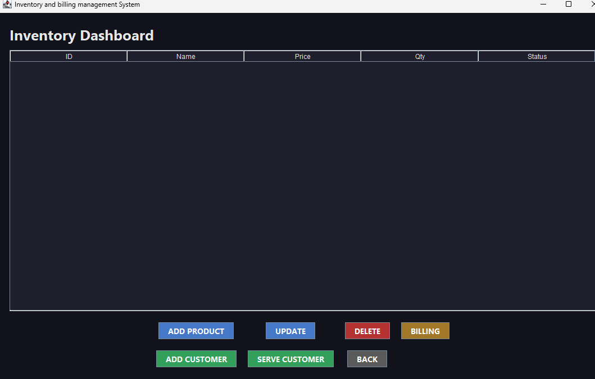

<h1>📦 Inventory and Billing Management System</h1>

<h2>📖 Overview</h2>

The <b>Inventory and Billing Management System</b> is a desktop-based application designed to efficiently manage products, customers, and sales transactions.

It provides a clean and interactive interface that simplifies inventory operations and billing, making it suitable for small retail businesses as well as academic learning projects.

<h2>🚀 Features</h2>
<ul>
  <li>Add, update, and delete products</li>
  <li>Real-time inventory tracking</li>
  <li>Customer registration and management</li>
  <li>Billing system with automatic total calculation</li>
  <li>User-friendly GUI built using Java Swing</li>
  <li>Smooth and organized navigation</li>
</ul>

<h2>🧠 Data Structures Used</h2>

<h3>🔹 Queue</h3>

Implements <b>First-Come-First-Served (FCFS)</b> logic to ensure fair and structured customer handling.

<h3>🔹 Linked List</h3>

Used to dynamically store inventory data, allowing efficient insertion and deletion of products without restructuring the system.

<h3>🔹 ArrayList</h3>

Provides fast data access and is used for displaying products smoothly in the graphical interface.

<h2>💻 Technologies Used</h2>
<ul>
  <li><b>Java</b></li>
  <li><b>Java Swing (GUI)</b></li>
  <li><b>Object-Oriented Programming (OOP)</b></li>
  <li><b>Data Structures (Queue, Linked List, ArrayList)</b></li>
</ul>

<h2>⚙️ How It Works</h2>
<ol>
  <li>Products are added and stored in the system</li>
  <li>Customers are registered and managed</li>
  <li>Customers are handled using queue logic</li>
  <li>Products are selected and billed</li>
  <li>Inventory updates automatically after each transaction</li>
</ol>

<h2>🎯 Purpose</h2>

This project demonstrates the practical implementation of core programming concepts and data structures in a real-world scenario.

It highlights how efficient data handling and structured system design can improve business operations.

<h2>✨ Future Improvements</h2>
<ul>
  <li>MySQL database integration</li>
  <li>Advanced search and filtering</li>
  <li>Sales reports and analytics</li>
  <li>Web-based version</li>
</ul>

<h2>📌 Conclusion</h2>

This project showcases a strong understanding of programming fundamentals, problem-solving, and system design.

It serves as a solid foundation for building more advanced applications, especially in software engineering and AI-related domains.

<h2>
  Sreenshots
</h2>
<h3>Application Front Page</h3>

<h3>Dashboard and Main page</h3>

